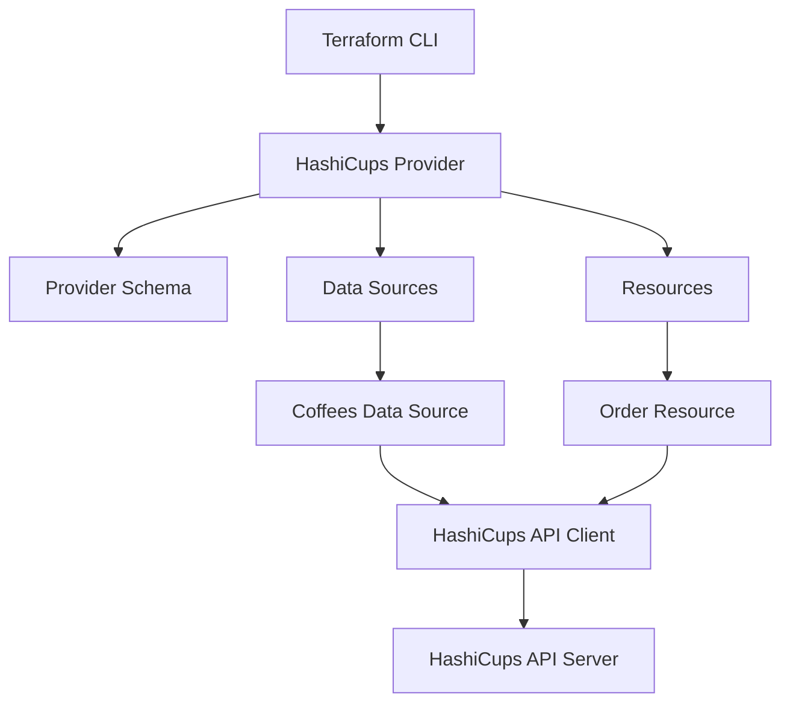

# HashiCups Terraform Provider - Implementation Plan

## Project Overview
Building a demo Terraform provider for HashiCups using the modern Terraform Plugin Framework. This provider will manage coffee shop resources including coffees (data source) and orders (resource).

## Architecture Overview



## Project Structure

```
hashicups/
├── main.go                          # Provider entry point
├── go.mod                           # Go module definition
├── go.sum                           # Go dependencies
├── internal/
│   └── provider/
│       ├── provider.go              # Provider implementation
│       ├── provider_test.go         # Provider tests
│       ├── coffees_data_source.go   # Coffees data source
│       ├── coffees_data_source_test.go
│       ├── order_resource.go        # Order resource
│       ├── order_resource_test.go
│       └── client/
│           ├── client.go            # API client
│           └── models.go            # Data models
├── examples/
│   ├── provider/
│   │   └── provider.tf              # Provider configuration example
│   ├── data-sources/
│   │   └── coffees/
│   │       └── data-source.tf       # Coffees data source example
│   └── resources/
│       └── order/
│           └── resource.tf          # Order resource example
├── docs/
│   ├── index.md                     # Provider documentation
│   ├── data-sources/
│   │   └── coffees.md
│   └── resources/
│       └── order.md
├── .github/
│   └── workflows/
│       └── test.yml                 # CI/CD pipeline
└── README.md                        # Project README
```

## Implementation Details

### 1. Provider Configuration
The provider will support:
- **host**: HashiCups API endpoint (default: `http://localhost:19090`)
- **username**: Authentication username
- **password**: Authentication password

### 2. Data Sources
**Coffees Data Source** (`hashicups_coffees`)
- Lists all available coffees
- Attributes: id, name, teaser, description, price, image
- Read-only operation

### 3. Resources
**Order Resource** (`hashicups_order`)
- Creates and manages coffee orders
- Attributes:
  - items (list of coffee items with coffee_id and quantity)
  - last_updated (timestamp)
- Supports: Create, Read, Update, Delete operations

### 4. API Client
- HTTP client for HashiCups API
- Authentication handling (JWT tokens)
- Endpoints:
  - `POST /signin` - Authentication
  - `GET /coffees` - List coffees
  - `POST /orders` - Create order
  - `GET /orders/{id}` - Read order
  - `PUT /orders/{id}` - Update order
  - `DELETE /orders/{id}` - Delete order

## Technology Stack
- **Language**: Go 1.21+
- **Framework**: terraform-plugin-framework v1.4+
- **Testing**: terraform-plugin-testing
- **API Client**: net/http (standard library)

## Testing Strategy
1. **Unit Tests**: Test individual functions and methods
2. **Acceptance Tests**: Test provider with actual Terraform operations
3. **Integration Tests**: Test against mock HashiCups API server

## Development Workflow
1. Initialize Go module with proper naming
2. Implement API client with authentication
3. Build provider schema and configuration
4. Implement data sources (coffees)
5. Implement resources (orders)
6. Add comprehensive tests
7. Create examples and documentation
8. Set up CI/CD pipeline

## Key Dependencies
```go
require (
    github.com/hashicorp/terraform-plugin-framework v1.4.2
    github.com/hashicorp/terraform-plugin-go v0.19.0
    github.com/hashicorp/terraform-plugin-testing v1.5.1
)
```

## Example Usage

```hcl
terraform {
  required_providers {
    hashicups = {
      source = "hashicorp.com/edu/hashicups"
    }
  }
}

provider "hashicups" {
  host     = "http://localhost:19090"
  username = "education"
  password = "test123"
}

data "hashicups_coffees" "all" {}

resource "hashicups_order" "edu" {
  items = [
    {
      coffee_id = 1
      quantity  = 2
    },
    {
      coffee_id = 2
      quantity  = 1
    }
  ]
}

output "coffees" {
  value = data.hashicups_coffees.all
}

output "order" {
  value = hashicups_order.edu
}
```

## Implementation Checklist

- [ ] Set up Go module and project structure
- [ ] Create provider configuration and schema
- [ ] Implement HashiCups API client
- [ ] Create data source for coffees
- [ ] Create resource for orders
- [ ] Implement provider authentication
- [ ] Add acceptance tests for data sources
- [ ] Add acceptance tests for resources
- [ ] Create example configurations
- [ ] Add documentation files
- [ ] Set up GitHub Actions for CI/CD
- [ ] Create README with usage instructions